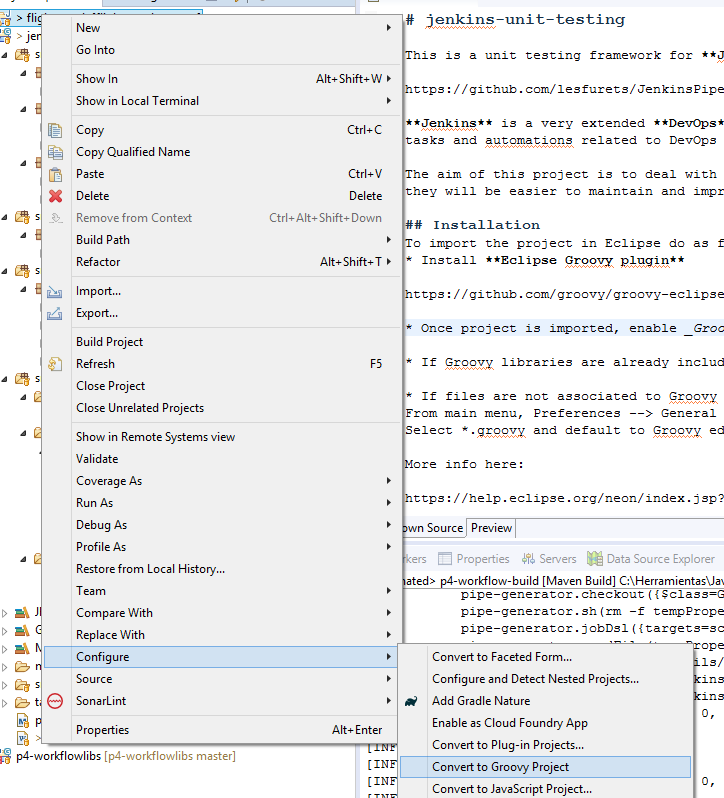
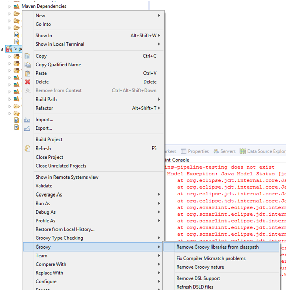
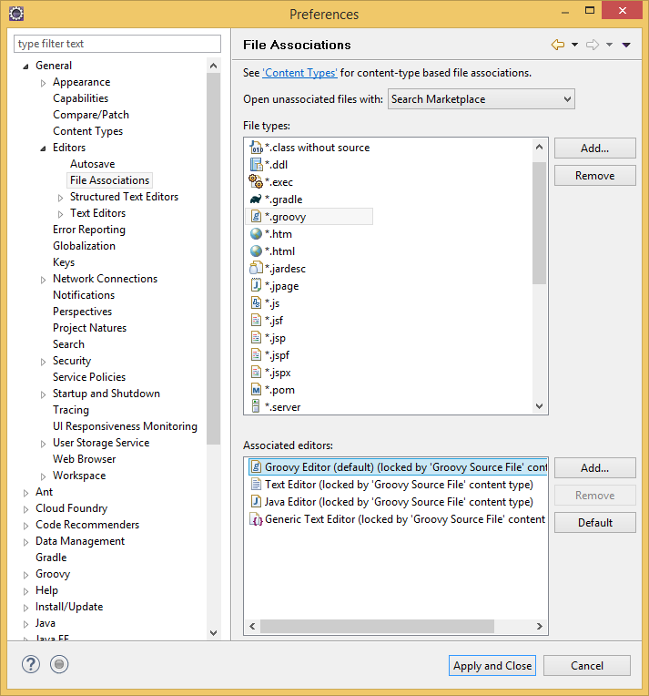

# jenkins-unit-testing

This is a unit testing framework for **Jenkins pipeline scripts** implemented in _Groovy_ and based on the following projects:

https://github.com/lesfurets/JenkinsPipelineUnit

**Jenkins** is a very extended **DevOps** tool, as one of the most well-known Continuous Integration servers. By using Jenkins scripts and pipelines, it is able to run multiple tasks and automations related to DevOps processes and SDLC cycle phases. These scripts can become rather complex and full of features.

The aim of this project is to deal with those Jenkins pipeline scripts and **Jenkinsfiles** as any other piece of code, providing a _toolset_ to unit test the scripts. In this way, they will be easier to maintain and improve the quality avoiding errors and incorrect modifications. It is a further step and a continuation of the _pipeline as code_ paradigm.

## Installation

To import the project in Eclipse do as followed:
* Install **Eclipse Groovy plugin**

https://github.com/groovy/groovy-eclipse/wiki

* Once project is imported, enable _Groovy_ feature in project



* If Groovy libraries are already included via project dependencies (maven pom, etc), remove Groovy libraries



* If files are not associated to Groovy editor, do as followed:



More info here:

https://help.eclipse.org/neon/index.jsp?topic=%2Forg.eclipse.platform.doc.user%2Freference%2Fref-13.htm

## Design

The framework is very simple and it is based on the previous mentioned project (**JenkinsPipelineUnit**). It basically offers a set of _Groovy_ classes to allow developing **JUnit test suites** to unit test _Jenkins pipelines scripts_ implemented in _Groovy_. The tests can also be implemented in _Java_.

It's being intended to follow best practices and common design patterns when developing the framework. We can find:
* Domain classes (**net.luisalbertogh.jenkins.unit.domain**)
	* Represent entities from the used data model
* Abstract classes (**net.luisalbertogh.jenkins.unit.base.AbstractPipelineTest**)
	* They contain most of the business logic. They cannot be initiated and have to be inherited from other clases 
* Utility classes (**net.luisalbertogh.jenkins.unit.base.Utils**)
	* They contain recurrent logic and actions commonly used and spread on different tests
* Test classes (**net.luisalbertogh.jenkins.unit.PipelineTest**)
	* Classes to be used as a reference or to be extended in order to implement new test cases.

## Project

The current project structure is:

```
src
|___main
	|___groovy 	- Groovy code implementing the framework
	test
	|___java 	- Sample test and framework testing in Java
	|___groovy 	- Sample test and framework testing in Groovy
	|___resources
		|___callstacks - It stores previous callstacks for regression testing
		|___pipelines - It contains the Jenkins pipelines to test (sample pipelines and needed scripts included)
		|___properties - Mock properties files used wihtin the tested pipelines 
```

To build the project, perform the following command:

```
$ mvn clean package
```

In order to run all the sample test, the following can be used:

```
$ mvn clean test
```

Alternatively, the related JUnit and executions features within Eclipse or any other used IDE can be applied here.

## Dependencies

These are the required Maven dependencies that have to be included within the project pom file:

```maven
<!-- Dependencies -->
<dependencies>
	<!-- Pipeline unit framework -->
	<dependency>
		<groupId>com.lesfurets</groupId>
		<artifactId>jenkins-pipeline-unit</artifactId>
		<version>1.1</version>
	</dependency>
	<!-- Junit 4 -->
	<dependency>
		<groupId>junit</groupId>
		<artifactId>junit</artifactId>
		<version>4.12</version>
	</dependency>
</dependencies>
```

Additionally, **Java 8** or upper is required.

## Write a test

The framework is created to develop JUnit test cases. The basic use would be the following:

1. Create the test suite class. Extend this class from the **PipelineTest** class present within the framework.
```groovy
class CyclingStatsPipelineGroovyTest extends PipelineTest {
...
}
```
2. Override the setUp method. Add any additional configuration here, like variables to bind, properties files to read, libraries to load or anything to be mocked in order to run the test successfully.
```groovy
/**
 * Set up test.
 */
@Override
@Before
public void setUp() {
    super.setUp()
    /* Define variables */
    binding.setVariable('scm', 'scm')
}
```
3. Implement the test. Each test should run the pipeline to test, optionally print the stack trace, perform the required assertions and finish.
```groovy
/**
 * Test execution.
 */
@Test
public void runTest() {
    /* Run the script */
    runScript('cycling-stats.pipeline')
    /* Print call stack */
    printCallStack()
    /* Assert step */
    assertTrue(helper.callStack.findAll({call -> call.methodName == "bat"}).any({call -> MethodCall.callArgsToString(call).contains("mvn deploy")}))
    /* Assert job status */
    assertJobStatusSuccess()
}
```
4. Optionally, clean up any used resource.

Find a set of implemented sample test cases under _src/test/groovy_.